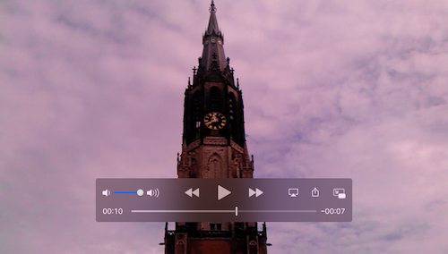
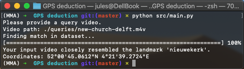
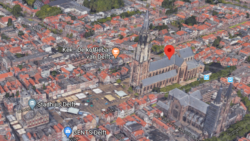

# Geo-location Prediction via Landmarks
This tool derives the GPS coordinates at which a video (in Delft) was taken. 

It does this by extracting [ORB features](https://en.wikipedia.org/wiki/Scale-invariant_feature_transform) from the input video, and matching these to a labelled database of landmarks in Delft.

## Example
1. `new-church-delft.m4v`

2. Running the script

3. Pasting `52°00'45.0612"N 4°21'39.2724"E` in Google Maps

## Using the tool
1. Install dependencies: `$ pip install -r requirements.txt`
2. Run the script: `$ python src/main.py`

## Creating your own dataset
Requisites: a folder with images from landmarks.  

NOTE: If an image in your dataset doesn't contain GPS metadata, the script will prompt you for manual provisioning. Set `SKIP_UNKNOWN_GEO` in `src/img_index.py` to `True` to instead skip said images.

**Steps**
1. Delete the `index` folder, which contains the default Delft dataset.
2. Rerun the script: `$ python src/main.py`, it will guide you through the creation of your own dataset.

## License
This repository is released under the MIT license. See [LICENSE](LICENSE) for additional details.